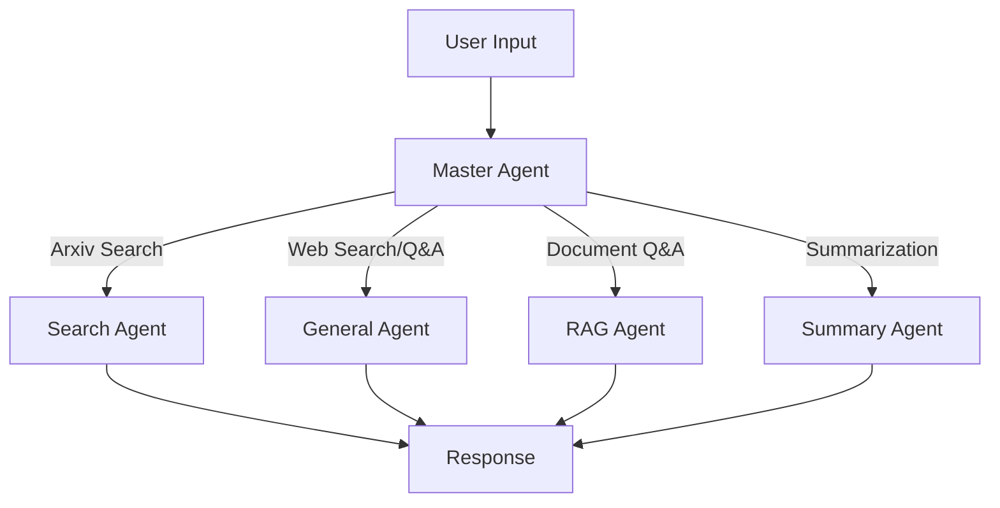

# 🤖 PaperFast

PaperFast is an AI-powered application designed to accelerate your paper research and study process. It leverages a team of intelligent agents to assist you in searching for, summarizing, and organizing academic papers, specifically from Arxiv.

## ✨ Features

*   **🤖 Multi-Agent Workflow**: Utilizes LangGraph to orchestrate specialized agents
    *   **Master Agent**: Intelligent routing based on user intent
    *   **Search Agent**: Arxiv paper search via MCP integration
    *   **General Agent**: Web search and general Q&A using EXA
    *   **RAG Agent**: Context-aware answers using uploaded PDFs
    *   **Summary Agent**: Comprehensive document summarization
*   **📄 PDF Support**: Upload and analyze multiple PDF documents with FAISS vector search
*   **💬 Interactive Chat Interface**: Built with Streamlit for a user-friendly experience
*   **📊 Conversation History**: SQLite-based persistent chat history with rename/delete capabilities
*   **🔍 Traceability**: Integrated with LangFuse for monitoring and tracing agent interactions
*   **⚡ Streaming Responses**: Real-time streaming of agent responses with status updates

## 🛠️ Tech Stack

*   **Python 3.12+**
*   **LangChain & LangGraph**: Multi-agent orchestration and workflow management
*   **Streamlit**: Interactive web interface
*   **UV**: Fast Python package management
*   **MCP (Model Context Protocol)**: Standardized tool integration (Arxiv, EXA)
*   **FAISS**: Vector similarity search for RAG
*   **SQLAlchemy**: Database ORM for conversation persistence
*   **LangFuse**: Observability and tracing
*   **OpenAI / Azure OpenAI**: LLM provider support

## 🚀 Getting Started

### Prerequisites

*   Python 3.12 or higher
*   [uv](https://github.com/astral-sh/uv) (recommended for dependency management)

### Installation

1.  **Clone the repository**
    ```bash
    git clone <repository-url>
    cd PaperFast
    ```

2.  **Install dependencies**
    ```bash
    uv sync
    ```

3.  **Set up MCP Server**
    For local MCP setup, you need to install the Arxiv MCP server tool:
    ```bash
    uv tool install arxiv-mcp-server
    ```

4.  **Environment Setup**
    Create a `.env` file in the root directory and add your necessary API keys (e.g., OpenAI, LangFuse). You can use `.env.example` as a reference if available.
    ```env
    OPENAI_API_KEY=your_api_key_here
    LANGFUSE_SECRET_KEY=your_langfuse_secret_key
    LANGFUSE_PUBLIC_KEY=your_langfuse_public_key
    LANGFUSE_HOST="https://cloud.langfuse.com"
    ```

### Running the Application

You can start the application using `poe` (if configured) or directly with Streamlit.

**Using poe:**
```bash
poe run
```

**Using streamlit directly:**
```bash
streamlit run app/main.py
```

## 📂 Project Structure

```
PaperFast/
├── app/
│   ├── main.py                      # Streamlit application entry point
│   ├── components/
│   │   └── sidebar.py              # UI sidebar with PDF upload, history, settings
│   ├── workflow/
│   │   ├── state.py                # LangGraph state definitions
│   │   ├── graph.py                # Workflow graph orchestration
│   │   └── agents/
│   │       ├── agent.py            # Base agent class with common logic
│   │       ├── master_agent.py     # Router agent for intent classification
│   │       ├── search_agent.py     # Arxiv paper search agent
│   │       ├── general_agent.py    # General Q&A and web search agent
│   │       ├── rag_agent.py        # RAG-based document Q&A agent
│   │       └── summary_agent.py    # Document summarization agent
│   ├── retrieval/
│   │   └── vector_store.py         # FAISS vector store management
│   ├── database/
│   │   ├── model.py                # SQLAlchemy models
│   │   ├── session.py              # Database session management
│   │   └── repository.py           # Data access layer
│   └── utils/
│       ├── config.py               # Environment configuration
│       └── state_manager.py        # Streamlit state management
├── pyproject.toml                   # Project dependencies and configuration
└── .env                            # Environment variables (not in git!)
```

## 🏗️ Architecture

### Multi-Agent Workflow



### Agent Responsibilities

| Agent | Purpose | Tools/Methods |
|-------|---------|---------------|
| **Master** | Routes queries to appropriate specialized agent | LLM with structured output |
| **Search** | Finds relevant academic papers | Arxiv MCP server |
| **General** | Handles general queries and web search | EXA web search MCP |
| **RAG** | Answers questions using uploaded PDFs | FAISS vector search |
| **Summary** | Creates comprehensive summaries | Document processing |

### Data Flow

1. User submits a query through Streamlit interface
2. Master agent analyzes intent and routes to specialized agent
3. Specialized agent processes query using appropriate tools
4. Response streams back to user with status updates
5. Conversation saved to SQLite database
6. All interactions traced in LangFuse

## 🔧 Configuration

### Environment Variables

Create a `.env` file in the root directory with:

```env
# OpenAI Configuration (for HOME mode)
OPENAI_API_KEY=your_openai_api_key
OPENAI_MODEL=gpt-4o-mini

# Azure OpenAI Configuration (for WORK mode)
AZURE_OPENAI_API_KEY=your_azure_key
AZURE_OPENAI_ENDPOINT=https://your-resource.openai.azure.com/
AZURE_OPENAI_API_VERSION=2024-08-01-preview
AZURE_OPENAI_DEPLOYMENT_NAME=your-deployment
AZURE_OPENAI_EMBEDDING_DEPLOYMENT=your-embedding-deployment

# LangFuse Tracing
LANGFUSE_SECRET_KEY=your_secret_key
LANGFUSE_PUBLIC_KEY=your_public_key
LANGFUSE_HOST=https://cloud.langfuse.com

# Application Settings
MODE=HOME  # HOME or WORK (switches between OpenAI/Azure)
DB_PATH=history.db  # SQLite database path
```

**⚠️ Security Note**: Never commit `.env` file to git! Use `.env.example` for reference.

## 🤝 Contributing

Contributions are welcome! Please feel free to submit a Pull Request.

### Development Setup

1. Install development dependencies: `uv sync --dev`
2. Run linting: `ruff check app/`
3. Format code: `black app/`
4. Run tests: `pytest` (coming soon)

## 📝 License

This project is licensed under the MIT License.

## 🙏 Acknowledgments

Built with:
- [LangChain](https://github.com/langchain-ai/langchain)
- [LangGraph](https://github.com/langchain-ai/langgraph)
- [Streamlit](https://streamlit.io/)
- [Model Context Protocol (MCP)](https://modelcontextprotocol.io/)
